# 🎮 UNO Backend - API REST com Programação Funcional

API REST construída com **Node.js**, **Express**, **Sequelize** e **SQLite** para gerenciar partidas do jogo UNO. Este projeto implementa conceitos de **Programação Funcional** seguindo os requisitos da **Jala University**.

---

## 🔥 Programação Funcional Aplicada

### Running the project
Start the development server with `npm run dev`

### FUNCIONALIDADES

### 1. (`CardService.js`)

**O que é:** Transformar uma função que recebe múltiplos argumentos em uma sequência de funções que recebem um argumento por vez.

**Aplicação:**
```javascript
/*
- Crud do Card (create,update,delete)
- Validação de carta
- Desenhar carta para o jogador (aparecer no baralho)

*/
async createDeck(gameId) {
        const colors = ['red', 'blue', 'green', 'yellow'];
        
        const cartasColoridas = colors.flatMap(cor => 
            gerarCartasPorCor(gameId, cor)
        );
        
        const cartasPretas = gerarCartasPretas(gameId);
        
        const baralhoCompleto = embaralhar([...cartasColoridas, ...cartasPretas]);
        
        // Persiste no banco
        return await CardRepository.createMany(baralhoCompleto);
    }

    async create(data) {
        if (!data.color) return Result.fail(new Error("Cor da carta não informada!"), 400);
        if (!data.value) return Result.fail(new Error("Valor da carta não informado!"), 400);
        if (!data.gameId) return Result.fail(new Error("Id do jogo não informado!"), 400);
        if (!data.pile) return Result.fail(new Error("Pilha não informada!"), 400);
        try{
            const newCard = await CardRepository.create(data);
            return Result.ok(newCard, 201)
        }catch(error){
            return Result.fail(error)
        }
    }

    async findAll() {
        try{
            const data = await CardRepository.findAll();
            return Result.of(data)
        }catch(error){
            return Result.fail(error)
        }
    }

    async findById(id) {
        try {
            if (!id) return Result.fail(new Error("Id de carta não inserido!"), 400);

            const card = await CardRepository.findById(id);
            if(!card) return Result.fail("Carta não encontrada!", 404);

            // Uso de Functor para transformar o dado sem mutação direta
            return Result.of(card)
            .map(c => (c.toJSON ? c.toJSON() : c))
            .map(c => ({
                ...c,
                label: `${c.color.toUpperCase()} - ${c.value}`,
                viewedAt: new Date().toISOString()
            }));
        } catch (error) {
            return Result.fail(error)
        }
    }

    async update(id, data) {
        try{
            const cardUpdated = await CardRepository.update(id, data);
            if(cardUpdated) return Result.of(cardUpdated);
            return Result.fail(new Error("Carta não encontrada para update"), 404)
        }catch(error){
            return Result.fail(error)
        }
    }

    async delete(id) {
        try{
            const card = await CardRepository.findById(id);
            if (!card) return Result.fail(new Error("Card not found to remove"), 404);
            await CardRepository.delete(card);
            return Result.of({Mensage: "Removido com sucesso"})
        }catch(error){
            return Result.fail(error)
        }
    }

    async drawCard(gameId) {
        const card = await CardRepository.findOne({
            where: {
                gameId,
                pile: 'draw'
            }
        });

        if (!card) {
            throw new Error('O baralho de compra está vazio!');
        }

    await CardRepository.update(card.id, {
        pile: 'discard'
    });

        return card;
    }

    validarJogada(cartaNoTopo) {
        return podeJogar(cartaNoTopo);
    }

    async drawToPlayer(gameId, playerId){
        const card = await CardRepository.findOne({
            where: {
                gameId,
                pile: 'draw'
            }
        });

        if(!card){
            throw new Error("Não a cartas no baralho");
        }

        await CardRepository.update(card.id, {
            pile: 'hand',
            playerId: playerId
        });

        console.log(await CardRepository.findAll())

        return card;
    }

/**
     * Retorna todas as cartas na mão de um jogador em uma partida específica.
     * Busca apenas as cartas que estão na pilha "hand",
     * ou seja, cartas que o jogador possui atualmente para jogar.
     *
     * @returns {Promise<Card[]>} Lista de cartas na mão do jogador.
     * Retorna um array vazio caso o jogador não possua cartas.
     */
    async seePlayerCards(gameId, playerId){
        try{
            const cards = await CardRepository.findAll({
                where:{
                    gameId,
                    playerId,
                    pile: "hand"
                },
                raw: true
            })
            console.log("As cartas são: ", cards)
            return Result.of(cards)
        }catch(error){
            return Result.fail(error)
        }
    }

/**
     * Realiza o descarte de uma carta da mão do jogador na partida.
     * Move a carta para a pilha de descarte, atualiza a carta no topo
     * do descarte no jogo e desvincula a carta do jogador.
     * Todas as operações são realizadas dentro de uma transação,
     * garantindo consistência dos dados em caso de falha.
     *
     * @returns {Promise<Result>} Retorna um Result de sucesso com os dados da carta descartada,
     * ou um Result de falha nos seguintes cenários:
     * - A carta não pertence ao jogador ou não está em sua mão
     * - Erro durante a atualização do jogo ou da carta no banco de dados
     */
    async jogarUmaCarta(gameId, playerId, cardId){
        const transaction = await sequelize.transaction()
        try{
            // Procura pela carta solicitada

            const card = await CardRepository.findOne({
                where:{
                    id: cardId,
                    gameId,
                    playerId,
                    pile: 'hand'
                }
            });
            // A carta não pertence ao jogador ou não existe
            if(!card) return Result.fail(new Error("Carta não pertence ao jogador"));

            await GameRepository.update( gameId, 
                {
                    topDiscardCardId: cardId
                },
                {transaction}
            )
            await CardRepository.update(
                cardId, 
                {
                    pile: 'discard',
                    playerId: null
                },
                {transaction}
            );
                
            await transaction.commit()
            return Result.of(card)
        }catch(error){
            await transaction.rollback()
            return Result.fail(error)
        }
    }


    
```

---

### 2. (`ScoreService.js`)

```javascript

// Cálculo de soma total da acumalação de pontos no score.
const calcularSomaTotal = (scores) => 
    scores.reduce((acumulador, score) => acumulador + score.score, 0);

// Exemplo: [100, 250, 50] → 400
```

```javascript
/**
 * MAP + SORT - Está servindo para formatar e ordenar o ranking
 * Retorna array de jogadores ordenados por pontuação
 */
const formatarRanking = (scores) => {
    // Agrupa scores por jogador usando reduce (!)
    const scoresPorJogador = scores.reduce((acc, score) => {
        const { playerId } = score;
        
        if (!acc[playerId]) {
            acc[playerId] = {
                playerId,
                totalScore: 0,
                partidas: []
            };
        }
        
        acc[playerId].totalScore += score.score;
        acc[playerId].partidas.push({
            gameId: score.gameId,
            score: score.score,
            data: score.createdAt
        });
        
        return acc;
    }, {});
    
    // Converte objeto em array e mapeia formato final
    return Object.values(scoresPorJogador)
        .map((jogador, index) => ({
            posicao: index + 1, // Será ajustado após sort
            playerId: jogador.playerId,
            pontuacaoTotal: jogador.totalScore,
            quantidadePartidas: jogador.partidas.length,
            mediaScore: jogador.totalScore / jogador.partidas.length,
            partidas: jogador.partidas
        }))
        .sort((a, b) => b.pontuacaoTotal - a.pontuacaoTotal) // Decrescente
        .map((jogador, index) => ({ ...jogador, posicao: index + 1 })); // Atualiza posição
};


/**
 * FILTER + MAP - Obter top N jogadores
 * Composição de funções de ordem superior
 */
const obterTopJogadores = (n) => (ranking) => 
    ranking.slice(0, n).map(({ playerId, pontuacaoTotal, posicao }) => ({
        posicao,
        playerId,
        pontuacaoTotal
    }));


```
```javascript

// CRUD do Score (create,update,delete)
async create(data) {
        try{
            // Validação simples
            if (!data.playerId || !data.gameId || data.score === undefined) {
                throw new Error('Dados incompletos para criar score');
            }

            const scoreNewPlayer = await ScoreRepository.create(data);
        
            return Result.of({message: "Score criado com sucesso!", score: scoreNewPlayer});

        }catch(error){
            return Result.fail(error)
        }
        
    }

    async findAll() {
        try{
            const scores = await ScoreRepository.findAll();
            return Result.of({message: "Scores encontrados com sucesso", score: scores})
        } catch(error){
            return Result.fail(error)
        }
         
    }

    async findById(id) {
        try{
            const scoreById = await ScoreRepository.findById(id);
            return Result.of({message: "Score do jogador encontrado", score: scoreById})
        } catch(error){
            return Result.fail(error)
        } 
    }

    async delete(id) {
        try{
            const score = await ScoreRepository.findById(id);
        if (!score) return Result.fail(new Error("Score não encontrado"), 404);

        await ScoreRepository.delete(score);
        return Result.of({message:"Score deletado"});

        }catch(error){
            return Result.fail(error)
        } 
    }

    /**
     *Obtem os top 10 jogadores
     */
    async obterTop10() {
        try{
            const { ranking } = await this.obterRankingGeral();
            const pegarTop10 = obterTopJogadores(10);
            
            return Result.of({message: "Top 10 obtido com sucesso!", pegarTop10: pegarTop10(ranking)});

        }catch(error){
            return Result.fail(error)
        }
        
    }

    /**
     Retorna estatísticas de um jogador específico
     */
    async obterEstatisticasJogador(playerId) {
        try{
            const todosScores = await ScoreRepository.findAll();
            const scoresDoJogador = todosScores.filter(s => s.playerId === playerId);
            
            if (scoresDoJogador.length === 0) return Result.of({message: "Não há estatísticas para o jogador no momento"})
            
            const total = calcularSomaTotal(scoresDoJogador);
            
            const estatistica = {
                playerId,
                pontuacaoTotal: total,
                partidas: scoresDoJogador.length,
                media: total / scoresDoJogador.length,
                melhorScore: Math.max(...scoresDoJogador.map(s => s.score)),
                piorScore: Math.min(...scoresDoJogador.map(s => s.score))
            };

            return Result.of({message: "Estatísticas obtidas com sucesso!", estatistica: estatistica})
        }catch(error){
            return Result.fail(error)
        }  
    }

```

---

### 3. (`GameService.js`)

```javascript
/**
 * Verifica se o usuário é o criador do jogo
 */
const ehCriador = (game) => (userId) => 
    game.creatorId === parseInt(userId);

/**
 * Verifica se todos os jogadores estão prontos
 */
const todosProntos = (jogadores) => 
    jogadores.every(jogador => jogador.ready === true);

/**
 * Verifica se tem jogadores suficientes (mínimo 2)
 */
const temJogadoresSuficientes = (jogadores) => 
    jogadores.length >= 2;

/**
 * Validação composta para iniciar jogo
 */
const podeIniciarJogo = (game, jogadores, userId) => {
    const validarCriador = ehCriador(game);
    if(!validarCriador(userId)) return Result.fail(new Error('Apenas o criador pode iniciar a partida'), 401);
    if(!todosProntos(jogadores)) return Result.fail(new Error('Nem todos os jogadores estão prontos'), 400);
    if(!temJogadoresSuficientes(jogadores)) return Result.fail(new Error('Mínimo de 2 jogadores necessário'), 400);

    return Result.ok({})
};

/**
     * Criar novo jogo
     */
    constructor(){
        this.history = {};
        this.unoStatus = {};
    }

    addHistory(gameId, player, action){
         if (!this.history[gameId]) {
        this.history[gameId] = [];
        }

        this.history[gameId].push({
            player,
            action,
            timestamp: new Date()
        });
    }

    async getHistory(gameId){
        try{
            const gameExists = await GameRepository.gameExists(gameId)
            if(!gameExists) return Result.fail(new Error("Partida não encontrada!"), 404);
            
            const history = this.history[gameId]
            if(!history) return Result.ok("Nenhum histórico foi encontrado para a partida", 204);
            return Result.of(history)
        }catch(error){
            return Result.fail(error)
        }
    }

    clearHistory(gameId){
       delete this.history[gameId];
    }

    async create(gameData, creatorId) {
        // << PODEMOS ADINCIONAR UMA TRANSACTION NESSE METODO  >>
        try{
            const player = UserRepository.findById(creatorId)
            if(!player) return Result.fail(new Error("Jogador não existe!"), 400);

            // Cria o jogo no banco
            const game = await GameRepository.create({
                ...gameData,
                creatorId,
                status: 'waiting'
            });

            // Adiciona o criador como primeiro jogador
            await GamePlayerRepository.create({
                gameId: game.id,
                playerId: creatorId,
                ready: true, // Criador já entra pronto
                position: 1
            });

            // Gera o baralho de 108 cartas
            await CardService.createDeck(game.id);
            return Result.ok(game, 201)
        }catch(error){
            return Result.fail(error)
        }
    }

    async findAll() {
        try{
            const games = await GameRepository.findAll();
            return Result.of(games)
        }catch(error){
            return Result.fail(error)
        }
    }

    async findById(id) {
        try{
            const result = await GameRepository.findById(id);
            return Result.of(result)
        }catch(error){
            return Result.fail(error)
        }
    }

    /**
     * Adicionar jogador à partida
     */
    async adicionarJogador(gameId, playerId) {
        try{
            const game = await GameRepository.findById(gameId);

            // Verificação de consistência do jogo
            if(!game) return Result.fail(new Error("Jogo não encontrado!"));
            if (game.status !== 'waiting') return Result.fail(new Error("Jogo já iniciado ou finalizado"));

            // Verifica se tem espaço na sala
            const jogadoresAtuais = await GamePlayerRepository.findByGameId(gameId);
            const salaCheia = jogadoresAtuais.length >= game.maxPlayers
            if (salaCheia) return Result.fail(new Error("Jogo já está cheio"));

            // Verifica se jogador já está na partida
            const jaEstaNoJogo = jogadoresAtuais.some(j => j.playerId === playerId);
            if (jaEstaNoJogo) return Result.fail(new Error("Jogador já está nesta partida"));

            const novoJogador = await GamePlayerRepository.create({
                gameId,
                playerId,
                ready: false,
                position: jogadoresAtuais.length + 1
            });

            return Result.ok(novoJogador, 201)

        }catch(error){
            return Result.fail(error)
        }
    }


    async distribuirCartas(gameId) {
        const jogadores =
            await GamePlayerRepository.findByGameId(gameId);

        for (const jogador of jogadores) {
            for (let i = 0; i < 7; i++) {
                await CardService.drawToPlayer(
                    gameId,
                    jogador.playerId
                );
            }
        }

        this.addHistory(gameId, "System", "Cards dealt");
    }
    /**
     * Marcar jogador como pronto
     */
    async marcarPronto(gameId, playerId) {
        try{
            //procura jogador na partida
            const jogador = await GamePlayerRepository.findOne(gameId, playerId);
            if (!jogador) return Result.fail('Jogador não está nesta partida', 400);
            //Atualiza o status do jogador para pronto
            await GamePlayerRepository.update(jogador, { ready: true });
            this.addHistory(gameId, `Player ${playerId}`, "ready")
            return Result.of({ message: 'Jogador marcado como pronto' })
        }catch(error){
            return Result.fail(error)
        }
    }

    /**
     * INICIAR JOGO - Validação de criador e jogadores prontos
     */
    async iniciarJogo(gameId, userId) {
        try{
            // Procura pela partida solicitada
            const game = await GameRepository.findById(gameId);
            if(!game) return Result.fail(new Error("Partida não encontrada"), 404);

            // Verifica se o jogo não começou
            const jogoIniciado = game.status !== 'waiting'
            if(jogoIniciado) return Result.fail(new Error("Jogo já foi iniciado ou finalizado"), 400);

            // Verifica se está tudo certo para iniciar a partida
            const jogadores = await GamePlayerRepository.findByGameId(gameId);
            const validacao = podeIniciarJogo(game, jogadores, userId);
            if (!validacao.ok) {
                const mensage = `Não foi possível iniciar o jogo: ${validacao.error.mensage}`;
                return Result.fail(new Error(mensage), validacao.status)
            }

            await GameRepository.update(gameId, {status: 'in_progress'}); // Atualiza status do jogo
            this.addHistory(gameId, `Player ${userId}`, "Started the game")
            await this.distribuirCartas(game.id); // distribui cartas

            // compra a primeira carta do baralho
            const primeiraCarta = await CardService.drawCard(game.id);
            this.addHistory(gameId, "System", `First card in discart pile: ${primeiraCarta.color} : ${primeiraCarta.value}`)
            
            // define como topo
            await GameRepository.update(gameId, {
                topDiscardCardId: primeiraCarta.id
            });

            return Result.of({
                message: "Jogo iniciado com sucesso",
                topCard: primeiraCarta
            })

        }catch(error){
            return Result.fail(error)
        }
    }

    /**
     * FINALIZAR JOGO - Apenas o criador pode
     */
    async finalizarJogo(gameId, userId) {
        try{
            const game = await GameRepository.findById(gameId);
            if (!game) return Result.fail(new Error('Jogo não encontrado'), 404);
            const jogoFinalizado = game.status === 'finished'
            if(jogoFinalizado) return Result.fail(new Error('Jogo já foi finalizado'), 400);

            // VALIDAÇÃO FUNCIONAL - Apenas criador
            const validarCriador = ehCriador(game);
            const naoEhCriador = !validarCriador(userId)
            if (naoEhCriador) return Result.fail(new Error('Apenas o criador da partida pode finalizá-la'), 400);

            const gameModified = await GameRepository.update(gameId, { status: 'finished' });
            this.addHistory(gameId,`Player ${userId}`, "end the game");

            return Result.of( {message: 'Jogo finalizado com sucesso!', game: gameModified })

        }catch(error){
            return Result.fail(error)
        }
    }

// O jogador abondona uma partida (jogo)
    async abandonarJogo(gameId, playerId) {
        const game = await GameRepository.findById(gameId);
        if (!game) return { error: 'Jogo não encontrado' };

        const jogador = await GamePlayerRepository.findOne(gameId, playerId);
        if (!jogador) return { error: 'Jogador não está na partida' };

        const jogadores = await GamePlayerRepository.findByGameId(gameId);
        // Remove jogador
        await GamePlayerRepository.delete(jogador);

        this.addHistory(gameId, `Player ${playerId}`, "abandoned the game");

        const restantes = jogadores.filter(j => j.playerId !== playerId);
        // Se sobrar apenas 1 → W.O.
        if (restantes.length <= 1 && game.status === 'in_progress') {
        await GameRepository.update(game, { status: 'finished' });
        
        this.addHistory(gameId,`System`, "the game end for w.o");

        return {
            message: 'Partida encerrada por W.O.'
        };
      }
    
    // Se era o criador → transfere
     
        if (game.creatorId === playerId) {
            await GameRepository.update(game, {
            creatorId: restantes[0].playerId
        });
      }

    // Ajusta turno se necessário
    
        if (jogador.position === game.currentPlayerPosition) {
        await this.proximoTurno(gameId);
     }

      return { message: 'Jogador abandonou a partida' };
    }

// Define o jogador da vez
    async jogadorDaVez(gameId) {
    const game = await GameRepository.findById(gameId);

    const jogador = await GamePlayerRepository.findByPosition(
        gameId,
        game.currentPlayerPosition
      );

       return jogador;
    }

    // Método para verificar fim de jogo e calcular pontos
    async checkGameOver(gameId) {
        const players = await GamePlayerRepository.findByGameId(gameId);
        // Vence quem ficar com 0 cartas
        const winner = players.find(p => p.hand && p.hand.length === 0);
        
        if (winner) {
            const scores = {};
            players.forEach(p => {
                // Soma os pontos das cartas que restaram na mão dos perdedores
                scores[p.playerName] = p.hand.reduce((total, card) => {
                    return total + this.calculateCardScore(card);
                }, 0);
            });
            
            await GameRepository.update(gameId, { status: 'finished' });
            return { winner: winner.playerName, scores };
        }

        return null;
    }

// Passa o turno para o próximo jogador
    async proximoTurno(gameId) {
        const game = await GameRepository.findById(gameId);

        const jogadores = await GamePlayerRepository.findByGameId(gameId);
        const total = jogadores.length;
        let novaPosicao = game.currentPlayerPosition + game.direction;
        
        if (novaPosicao > total) novaPosicao = 1;
        
        if (novaPosicao < 1) novaPosicao = total;
        await GameRepository.update(gameId, {
            currentPlayerPosition: novaPosicao
        });

        this.addHistory(gameId, "System", `Turn changed to position ${novaPosicao}`);

        return novaPosicao;
    }

// Pega o id da carta do topo do descarte
    async topoDescarte(gameId) {
      const game = await GameRepository.findById(gameId);

       return await CardService.findById(
        game.topDiscardCardId
      );
    }

// Atualiza um jogo existente
    async update(id, data, options={}) {
        try{
            const info = await GameRepository.update(id, data, options);
            if(info) return Result.of(info);
            return Result.fail(new Error("Jogo não encontrado"), 401)
        }catch(error){
            return Result.fail(error)
        }
    }
    // Deleta um jogo existente
    async delete(id) {
        try{
            const game = await GameRepository.findById(id);
            if (!game) Result.fail(new Error("Jogo não encontrado!"), 401);
            await GameRepository.delete(game);
            return Result.of({mensage: "Jogo removido com sucesso!"})
        }catch(error){
            return Result.fail(error)
        }
    }

    async seePlayerHand(gameId, playerId){
        return await CardService.seePlayerCards(gameId, playerId)
    }

    /**
     * Delega a ação de descartar uma carta ao serviço responsável.
     */
    async jogarUmaCarta(gameId, playerId, cardId){
        return await CardService.jogarUmaCarta(gameId, playerId, cardId)
    }
    
    // Retorna o ranking da partida
    async obterRankingPartida(gameId) {
        try{
            // Verifica se o jogo existe
            const gameExists = await GameRepository.gameExists(gameId);
            if(!gameExists) return Result.fail(new Error("Partida não encontrada"), 404);
            
            // Procura pelos jogadores na partida e monta o ranking
            const jogadores = await GamePlayerRepository.findScoresByGameId(gameId);
            const ranking = jogadores.map((jogador, index) =>({
                position: index + 1,
                playerId: jogador.playerId,
                score: jogador.score
            }))
            return Result.of({ranking})
            
        }catch(error){
            return Result.fail(error)
        }
    }

// O jogador pode continuar comprando cartas se não possuir nenhuma carta necessária jogável no momento do jogo.
    async comprarSeNaoPuderJogar(gameId, playerId){
        try{
            const topoResultado = await this.topoDescarte(gameId);
            
            const topo = topoResultado.value;

            const resultadoMao = await this.seePlayerHand(gameId, playerId);
            if(!resultadoMao.ok) return resultadoMao;

            const mao = resultadoMao.value;

            const podeJogar = CardService.validarJogada(topo);

            const cartaJogavel = mao.find(c => podeJogar(c));
            console.log("cheguei aqui 1")

            if (cartaJogavel){
                console.log("cheguei aqui 2")
                return Result.of({message: "Jogador possui carta jogável", podeJogar: true})
                
            }

            const novaCarta = await CardService.drawToPlayer(gameId, playerId);
            console.log("cheguei aqui 6")

            if(podeJogar(novaCarta)){
                console.log("cheguei aqui 3")
                return Result.of({message: "Jogador possui carta jogável", carta: novaCarta})
            }
            console.log("cheguei aqui 4")
            await this.proximoTurno(gameId);
            console.log("cheguei aqui 5")

            return Result.of({message:"Carta comprada não é jogável. Turno passado.", carta: novaCarta })
        } catch(error){
            return Result.fail(error)
        }
    }


```

---

### 4️⃣  (`UserService.js`)

```javascript
/**
 * Cria um novo usuário após validar os campos obrigatórios e verificar
 * se o e-mail já está cadastrado.
 */
async function create(data) {
    if (!data.password) return Result.fail(new Error("Senha de usuário não informada!"), 400);
    if (!data.userName) return Result.fail(new Error("Nome de jogador não informado!"), 400);
    if (!data.name) return Result.fail(new Error("Nome de usuário não informado!"), 400);
    if (!data.email) return Result.fail(new Error("Email do usuário não informado!"), 400);

    try{
        const emailExist = await UserRepository.emailExist(data.email);
        if (emailExist) return Result.fail(new Error("Email já cadastrado"), 406);

        const user = await UserRepository.create(data);
        return Result.of(user)
    }catch(error){
        return Result.fail(error)
    }
}

/**
 * Busca um usuário pelo seu ID.
 */
async function findById(id) {
    try{
        const user = await UserRepository.findById(id);
        if(user) return Result.of(user);
        return Result.fail("User not found", 404)
    }catch(err){
        return Result.fail(err)
    }
}

/**
 * Atualiza os dados de um usuário existente.
 */
async function update(id, data) {
    try{
        const userUpdated = await UserRepository.update(id, data);
        if(userUpdated) return Result.of(userUpdated);
        return Result.fail("User not found", 404)
    }catch(err){
        return Result.fail(err)
    }
}

/**
 * Retorna todos os usuários cadastrados.
 */
async function findAll() {
    try{
        const allUsers = await UserRepository.findAll();
        return Result.of(allUsers)
    }catch(err){
        return Result.fail(err)
    }
}

/**
 * Remove um usuário pelo seu ID.
 */
async function deleteUser(id) {
    try{
        const userDeleted = await UserRepository.delete(id);
        if(userDeleted) return Result.of("User account was deleted successfully");
        return Result.fail("User not found", 404)
    }catch(err){
        return Result.fail(err)
    }
}

/**
 * Busca um usuário pelo seu e-mail.
 * Utilizado principalmente no processo de autenticação.
 */
async function findUserByEmail(email) {
    try{
        const user = await UserRepository.findByEmail(email);
        if (!user) return Result.fail(new Error("User not found"), 404);
        return Result.of(user)
    }catch(error){
        return Result.fail(error)
    }
}
```

### 5. (`AuthService.js`)

```javascript
// Pega o email e password do usuário para realizar o login no Jogo e com isso recebe um token
async login(email, password) {
    const result = await findUserByEmail(email);
    if(!result.ok) return result

    const user = result.value

    const senhaValida = await bcrypt.compare(password, user.password);
    if (!senhaValida) return Result.fail(new Error("Senha inválida"), 401)

    const secret = process.env.JWT_SECRET || "fallback_secret_dev";
    const token = jwt.sign(
      { id: user.id, email: user.email },
      secret,
      { expiresIn: "1h" }
    );

    return Result.of(token)
  }

// Através do token recebido no login é possível sair do jogo (logout)
  async logout(token) {
    await TokenBlacklist.create({ token });
    return { message: "Logout realizado com sucesso" };
  }

```

### 6. (`APIUsageLogService.js`)

## Serviço responsável pelo gerenciamento dos logs de uso da API.
 * Realiza a comunicação com o banco de dados por meio do modelo APIUsageLog.
```javascript

/**
     * Registra um novo log de uso da API no banco de dados.
     *
     * @returns {Promise<Result>} Retorna um Result de sucesso com os dados do log criado,
     * ou um Result de falha com o erro ocorrido
     */
    async register(apiUsageLogData){
        try{
            const newInstance = await APIUsageLog.create(apiUsageLogData)
            return Result.of(newInstance.dataValues)
        }catch(error){
            return Result.fail(error)
        }
    }

    /**
     * Contabiliza e agrupa todas as requisições registradas na API,
     * organizando-as por endpoint e método HTTP.
     *
     * @returns {Promise<Result>} Retorna um Result de sucesso contendo:
     * - `total_requests` {number} - Total geral de requisições registradas
     * - `breakdown` {Object} - Requisições agrupadas por endpoint e método HTTP
     *
     * Em caso de erro, retorna um Result de falha com o erro ocorrido.
     */
    async countRequest(){
        try{
            const allLogs = await APIUsageLog.findAll({raw: true})
            const breakdown = allLogs.reduce((acc, log) => {
                    const endPoint = log.endpointAccess
                    const method = log.requestMethod

                    if(!acc[endPoint]) acc[endPoint] = {};
                    if(!acc[endPoint][method]) acc[endPoint][method] = 0;

                    acc[endPoint][method] += 1
                    return acc
                }, 
                {})
            
            const total_requests = allLogs.length
            return Result.of({total_requests, breakdown})

        }catch(error){
            return Result.fail(error)
        }
    }

    /**
     * Contabiliza e agrupa todas as requisições registradas na API
     * pelo código de status HTTP retornado.
     * 
     * @returns {Promise<Result>} Retorna um Result de sucesso contendo um objeto
     * onde cada chave é um código de status HTTP e o valor é a quantidade de
     * vezes que foi retornado.
     *
     * Em caso de erro, retorna um Result de falha com o erro ocorrido.
     */
    async countStatusCode(){
        try{
            const allLogs = await APIUsageLog.findAll({raw:true})

            const data = allLogs.reduce((acc, log)=>{
                const status = log.statusCode

                if(!acc[status]) acc[status] = 0;
                acc[status] += 1

                return acc
            }, {})

            return Result.of(data)
        }catch(error){
            return Result.fail(error)
        }
    }

    /**
     * Retorna o endpoint mais acessado da API,
     * com base na contagem total de requisições registradas nos logs.
     *
     * @returns {Promise<Result>} Retorna um Result de sucesso contendo um objeto com:
     * - `most_popular` {string} - Endpoint com maior número de acessos
     * - `request_count` {number} - Total de requisições realizadas para esse endpoint
     *
     * Em caso de erro, retorna um Result de falha com o erro ocorrido.
     */
    async mostPopularEndpoint(){
        try{
            const data = await APIUsageLog.findOne({
                attributes:[
                    ['endpointAccess', "most_popular"],
                    [fn("COUNT", col('endpointAccess')), "request_count"]
                ],
                group: ["endpointAccess"],
                order: [[fn("COUNT", col("endpointAccess")), "DESC"]]
            })

            return Result.of(data)

        }catch(erro){
            return Result.fail(error)
        }
    }

    /**
     * Retorna estatísticas de tempo de resposta agrupadas por endpoint,
     * incluindo os valores médio, mínimo e máximo de cada um.
     
     * @returns {Promise<Result>} Retorna um Result de sucesso contendo um objeto
     * onde cada chave é um endpoint e o valor é um objeto com as estatísticas
     * de tempo de resposta em milissegundos:
     * - `avg` {number} - Tempo médio de resposta
     * - `min` {number} - Tempo mínimo de resposta
     * - `max` {number} - Tempo máximo de resposta
     *
     * Em caso de erro, retorna um Result de falha com o erro ocorrido.
     */
    async requestResponseTime(){
        try{

            const logs = await APIUsageLog.findAll({
                attributes:[
                    ['endpointAccess', 'endpoint'],
                    [fn("AVG", col("responseTime")), "avg"],
                    [fn("MIN", col("responseTime")), "min"],
                    [fn("MAX", col("responseTime")), "max"]
                ],

                group: ["endpointAccess"],

                raw:true
            })

            const data = logs.reduce((acc, log) =>{
                acc[log.endpoint] = {
                    avg: log.avg,
                    min: log.min,
                    max: log.max
                }
                return acc
            }, {})

            return Result.of(data)
        }catch(erro){
            return Result.fail(erro)
        }
    }


```


---

## 🛠️ Tecnologias & Pacotes

- **express** – Framework web
- **sequelize** – ORM para banco de dados
- **sqlite3** – Banco de dados leve
- **bcrypt** – Hash de senhas
- **jsonwebtoken** – Autenticação JWT
- **nodemon** – Hot reload em desenvolvimento

---

## 🚀 Instalação e Execução

### Pré-requisitos
- Node.js (v14+)
- npm

### Passos
```bash
# 1. Instalar dependências
npm ci

# 2. Iniciar servidor de desenvolvimento
npm run dev

# Servidor rodando em http://localhost:3000
```

---

## 📋 Documentação da API

### 🔐 Usuários (Users)

| Método | Endpoint | Descrição |
|--------|----------|-----------|
| POST | `/api/users` | Criar novo usuário |
| POST | `/api/users/login` | Autenticar usuário |
| GET | `/api/users` | Listar todos os usuários |
| GET | `/api/users/:id` | Buscar usuário por ID |
| DELETE | `/api/users/:id` | Deletar usuário |

**Criar Usuário:**

Json de Entrada:

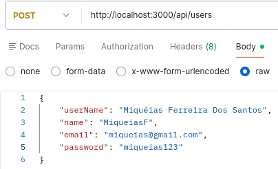


Json de Saída: 


**Login:**

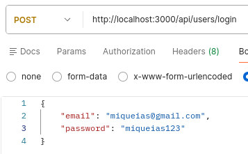

Resposta:

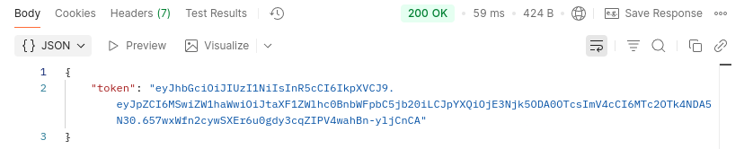


**Logout**

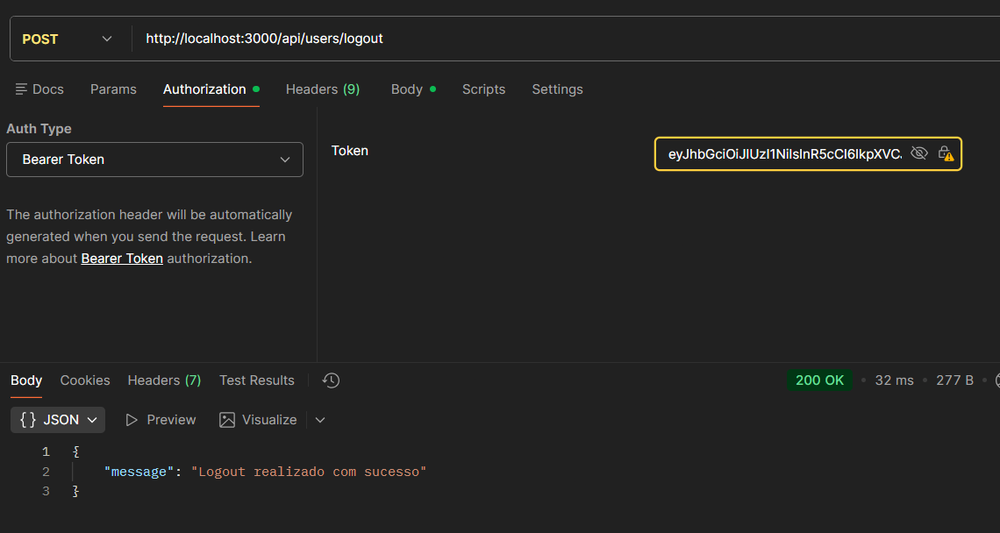

**Perfil do Usuário** 

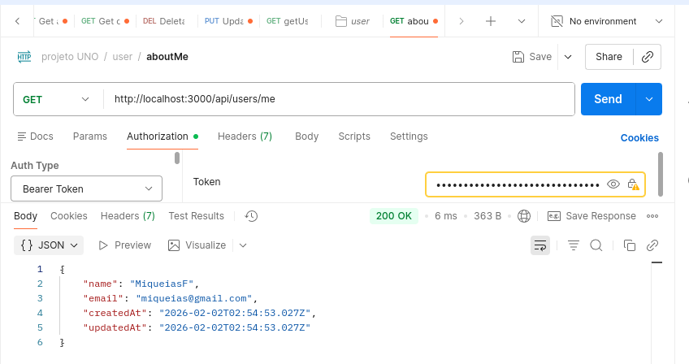


**Pegando pelo ID** 

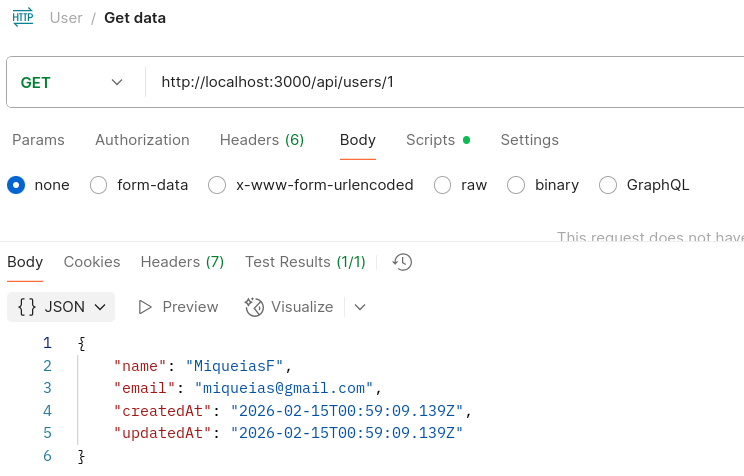

**Update - Atualizando usuário**

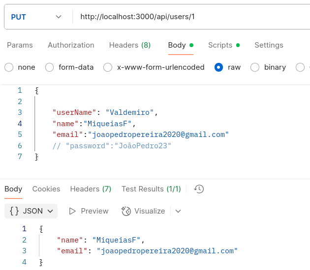

**Pegando todos Users** 
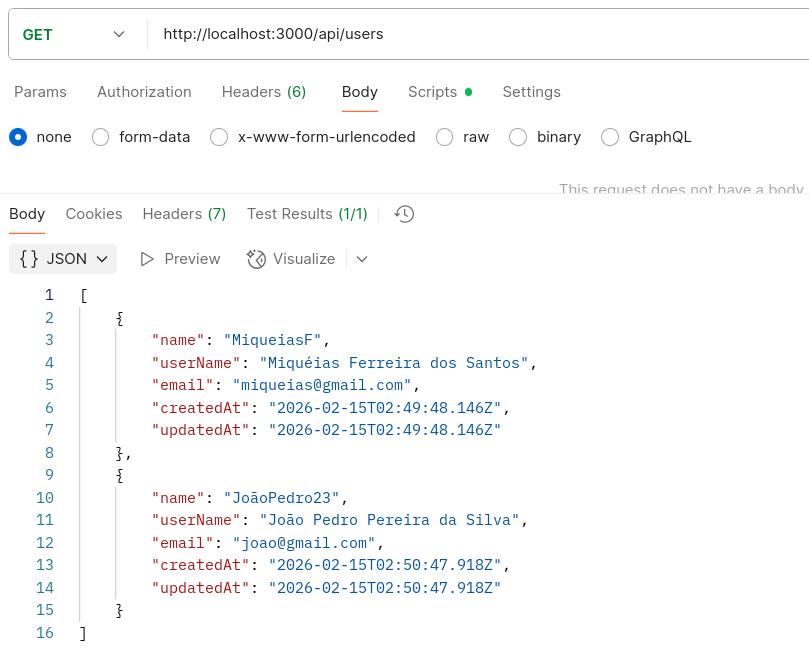

**Deletando um User**
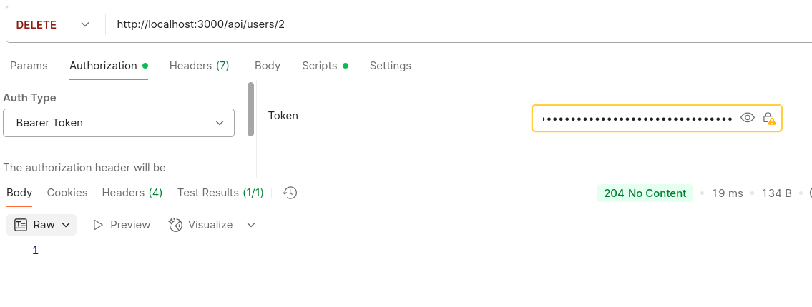


### 🎮 Jogos (Games)

| Método | Endpoint | Descrição |
|--------|----------|-----------|
| POST | `/api/games` | Criar nova partida |
| GET | `/api/games` | Listar todas as partidas |
| GET | `/api/games/:id` | Buscar partida por ID |
| POST | `/api/games/:id/join` | ➕ **Novo:** Entrar na partida |
| POST | `/api/games/:id/ready` | ✅ **Novo:** Marcar como pronto |
| POST | `/api/games/:id/start` | 🚀 **Novo:** Iniciar jogo (criador + validações) |
| POST | `/api/games/:id/finish` | 🏁 **Novo:** Finalizar jogo (apenas criador) |
| DELETE | `/api/games/:id` | Deletar partida |

**Criar Jogo:**

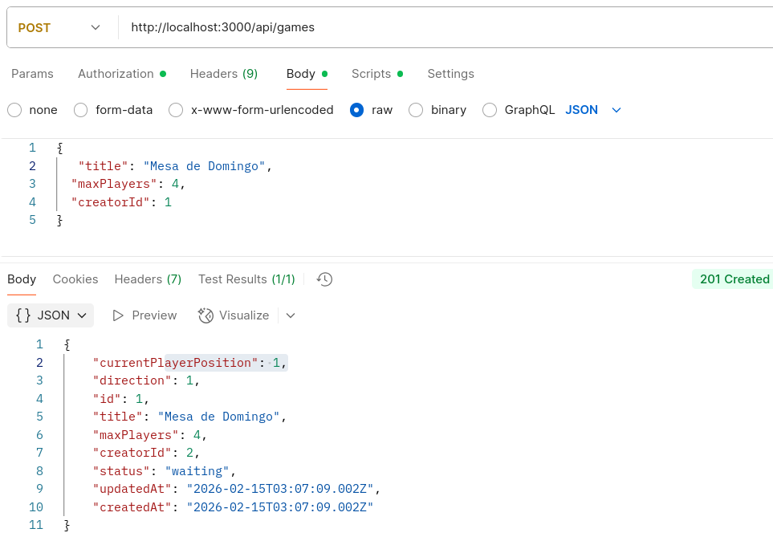

**Entrar na Partida:**
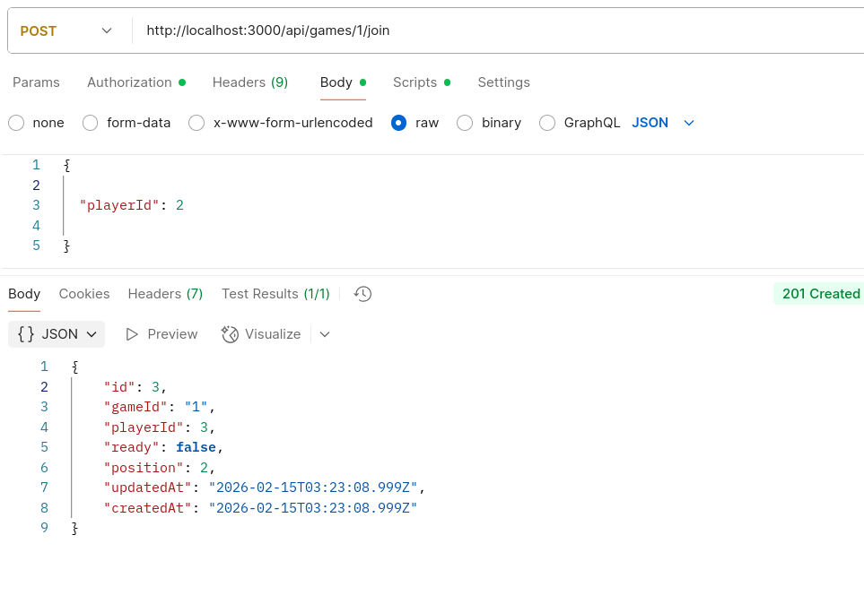

**Exemplo - Iniciar Jogo (COM VALIDAÇÕES):**
```json
POST /api/games/1/start
{
  "userId": 1
}

// ✅ Sucesso (criador + todos prontos):
{
  "message": "Jogo iniciado com sucesso!",
  "game": {
    "id": 1,
    "status": "in_progress"
  }
}

// ❌ Erro (não é criador):
{
  "error": "Não foi possível iniciar o jogo",
  "motivos": ["Apenas o criador pode iniciar a partida"]
}

// ❌ Erro (jogadores não prontos):
{
  "error": "Não foi possível iniciar o jogo",
  "motivos": ["Nem todos os jogadores estão prontos"]
}
```

---

### 🃏 Cartas (Cards)

| Método | Endpoint | Descrição |
|--------|----------|-----------|
| POST | `/api/cards` | Criar carta individual |
| GET | `/api/cards` | Listar todas as cartas |
| GET | `/api/cards/:id` | Buscar carta por ID |
| PUT | `/api/cards/:id` | Atualizar carta |
| DELETE | `/api/cards/:id` | Deletar carta |

**Estrutura de Carta (com efeitos):**
```json
{
  "id": 1,
  "gameId": 1,
  "color": "red",
  "value": "skip",
  "especial": true,
  "efeito": "PULAR_PROXIMO"
}
```

**Efeitos disponíveis:**
- `skip` → `PULAR_PROXIMO`
- `reverse` → `INVERTER_ORDEM`
- `draw2` → `COMPRAR_2`
- `wild` → `ESCOLHER_COR`
- `wild_draw4` → `COMPRAR_4_E_ESCOLHER_COR`

---

### 🏆 Pontuações (Scores)

| Método | Endpoint | Descrição |
|--------|----------|-----------|
| POST | `/api/scores` | Criar nova pontuação |
| GET | `/api/scores` | Listar todas as pontuações |
| GET | `/api/scores/:id` | Buscar pontuação por ID |
| GET | `/api/scores/ranking/geral` | 🏆 **Novo:** Ranking completo |
| GET | `/api/scores/ranking/top10` | 🥇 **Novo:** Top 10 jogadores |
| GET | `/api/scores/player/:playerId/stats` | 📊 **Novo:** Estatísticas de jogador |
| PUT | `/api/scores/:id` | Atualizar pontuação |
| DELETE | `/api/scores/:id` | Deletar pontuação |

**Exemplo - Criar Score:**
```json
POST /api/scores
{
  "playerId": 1,
  "gameId": 1,
  "score": 500
}
```

**Exemplo - Ranking Geral (usando `.reduce()` e `.map()`):**
```json
GET /api/scores/ranking/geral

// Resposta:
{
  "ranking": [
    {
      "posicao": 1,
      "playerId": 3,
      "pontuacaoTotal": 1250,
      "quantidadePartidas": 5,
      "mediaScore": 250
    },
    {
      "posicao": 2,
      "playerId": 1,
      "pontuacaoTotal": 980,
      "quantidadePartidas": 4,
      "mediaScore": 245
    }
  ],
  "somaTotal": 2230,
  "totalPartidas": 9
}
```

**Exemplo - Estatísticas de Jogador:**
```json
GET /api/scores/player/1/stats

// Resposta:
{
  "playerId": 1,
  "pontuacaoTotal": 980,
  "partidas": 4,
  "media": 245,
  "melhorScore": 350,
  "piorScore": 150
}
```

---

## 🧪 Testando no Postman

### Coleção de Testes

Crie uma **Collection** no Postman chamada `UNO API` e adicione os seguintes testes:

#### **1. Fluxo Completo de Partida**

```
1️⃣ Criar Usuário 1 (Criador)
POST /api/users
{
  "name": "Alice",
  "userName": "alice123",
  "email": "alice@email.com",
  "password": "senha123"
}

2️⃣ Criar Usuário 2
POST /api/users
{
  "name": "Bob",
  "userName": "bob456",
  "email": "bob@email.com",
  "password": "senha123"
}

3️⃣ Criar Partida (Alice = criador)
POST /api/games
{
  "title": "Partida Teste",
  "maxPlayers": 4,
  "creatorId": 1
}

4️⃣ Bob entra na partida
POST /api/games/1/join
{
  "playerId": 2
}

5️⃣ Bob marca como pronto
POST /api/games/1/ready
{
  "playerId": 2
}

6️⃣ Tentar iniciar (FALHA - Alice não está pronta)
POST /api/games/1/start
{
  "userId": 1
}
// Erro: "Nem todos os jogadores estão prontos"

7️⃣ Alice marca como pronta
POST /api/games/1/ready
{
  "playerId": 1
}

8️⃣ Iniciar jogo (SUCESSO)
POST /api/games/1/start
{
  "userId": 1
}
// Sucesso: status muda para "in_progress"

9️⃣ Finalizar jogo (apenas Alice pode)
POST /api/games/1/finish
{
  "userId": 1
}
// Sucesso: status muda para "finished"

🔟 Bob tenta finalizar (FALHA)
POST /api/games/1/finish
{
  "userId": 2
}
// Erro: "Apenas o criador da partida pode finalizá-la"
```

#### **2. Testes de Programação Funcional**

```
1️⃣ Criar Scores
POST /api/scores (múltiplas vezes com valores diferentes)

2️⃣ Obter Ranking (usa .reduce() e .map())
GET /api/scores/ranking/geral

3️⃣ Obter Top 10 (composição de funções)
GET /api/scores/ranking/top10

4️⃣ Stats de Jogador (filter + reduce)
GET /api/scores/player/1/stats
```

---

## ✅ Checklist de Requisitos Implementados

- [x] **Currying** - `podeJogar()` no `CardService.js`
- [x] **Funções de Ordem Superior** - `.reduce()`, `.map()`, `.filter()` no `ScoreService.js`
- [x] **Imutabilidade** - `embaralhar()` cria novo array no `CardService.js`
- [x] **Funções Puras** - `ehCriador()`, `todosProntos()` no `GameService.js`
- [x] **Validação de Criador** - Apenas criador pode iniciar/finalizar partida
- [x] **Validação de Jogadores Prontos** - Todos devem estar `ready: true`
- [x] **Cartas Especiais** - Estrutura com `efeito` e `especial: boolean`
- [x] **Tratamento de Erros** - JSON padronizado `{"error": "mensagem"}`

---

## 📖 Explicação Didática

**Por que Programação Funcional?**

1. **Previsibilidade:** Funções puras sempre retornam o mesmo resultado
2. **Testabilidade:** Fácil de testar porque não há efeitos colaterais
3. **Reutilização:** Currying e HOF permitem criar funções especializadas
4. **Segurança:** Imutabilidade evita bugs causados por mutações acidentais

**Exemplo prático:**

Antes (imperativo):
```javascript
let total = 0;
for (let i = 0; i < scores.length; i++) {
    total += scores[i].score; // Mutação!
}
```

Depois (funcional):
```javascript
const total = scores.reduce((acc, s) => acc + s.score, 0);
```

---

## 👥 Autores

Projeto desenvolvido para a disciplina de Programação 4 - Jala University

---

## 📝 Licença

ISC