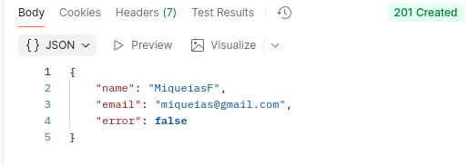

# 🎮 UNO Backend - API REST com Programação Funcional

API REST construída com **Node.js**, **Express**, **Sequelize** e **SQLite** para gerenciar partidas do jogo UNO. Este projeto implementa conceitos de **Programação Funcional** seguindo os requisitos da **Jala University**.

---

## 🔥 Programação Funcional Aplicada

### Running the project
Start the development server with `npm run dev`


### 1️⃣ **Currying** (`CardService.js`)

**O que é:** Transformar uma função que recebe múltiplos argumentos em uma sequência de funções que recebem um argumento por vez.

**Aplicação:**
```javascript
// Função com Currying para validar jogadas
const podeJogar = (cartaNoTopo) => (cartaJogada) => {
    if (cartaJogada.color === 'black') return true;
    return cartaNoTopo.color === cartaJogada.color || 
           cartaNoTopo.value === cartaJogada.value;
};

// Uso:
const validador = podeJogar({ color: 'red', value: '7' });
validador({ color: 'red', value: '3' }); // true (mesma cor)
validador({ color: 'blue', value: '7' }); // true (mesmo valor)
validador({ color: 'blue', value: '3' }); // false
```

**Por que é útil?** Permite criar validadores reutilizáveis e específicos para diferentes contextos.

---

### 2️⃣ **Funções de Ordem Superior** (`ScoreService.js`)

**O que é:** Funções que recebem outras funções como parâmetro ou retornam funções.

**Aplicações:**

#### **`.reduce()` para soma total:**
```javascript
const calcularSomaTotal = (scores) => 
    scores.reduce((acumulador, score) => acumulador + score.score, 0);

// Exemplo: [100, 250, 50] → 400
```

#### **`.map()` para formatar ranking:**
```javascript
const formatarRanking = (scores) => {
    const scoresPorJogador = scores.reduce((acc, score) => {
        // Agrupa por jogador
        return acc;
    }, {});
    
    return Object.values(scoresPorJogador)
        .map((jogador, index) => ({
            posicao: index + 1,
            playerId: jogador.playerId,
            pontuacaoTotal: jogador.totalScore,
            mediaScore: jogador.totalScore / jogador.partidas.length
        }))
        .sort((a, b) => b.pontuacaoTotal - a.pontuacaoTotal);
};
```

#### **Composição de funções:**
```javascript
const obterTopJogadores = (n) => (ranking) => 
    ranking.slice(0, n).map(({ playerId, pontuacaoTotal, posicao }) => ({
        posicao,
        playerId,
        pontuacaoTotal
    }));

const pegarTop10 = obterTopJogadores(10);
pegarTop10(rankingCompleto); // Retorna top 10
```

---

### 3️⃣ **Imutabilidade** (`CardService.js`)

**O que é:** Nunca modificar dados existentes, sempre criar novas cópias.

**Aplicação:**
```javascript
// ❌ ERRADO (muta o array original)
function embaralharRuim(deck) {
    for (let i = deck.length - 1; i > 0; i--) {
        const j = Math.floor(Math.random() * (i + 1));
        [deck[i], deck[j]] = [deck[j], deck[i]]; // Modifica original!
    }
    return deck;
}

// ✅ CORRETO (cria novo array)
const embaralhar = (deck) => {
    const novoArray = [...deck]; // Spread operator cria cópia!
    
    for (let i = novoArray.length - 1; i > 0; i--) {
        const j = Math.floor(Math.random() * (i + 1));
        [novoArray[i], novoArray[j]] = [novoArray[j], novoArray[i]];
    }
    
    return novoArray;
};

// Uso:
const baralhoOriginal = [1, 2, 3, 4, 5];
const baralhoEmbaralhado = embaralhar(baralhoOriginal);
// baralhoOriginal continua [1, 2, 3, 4, 5] ✅
```

---

### 4️⃣ **Funções Puras** (`GameService.js`)

**O que é:** Funções que sempre retornam o mesmo resultado para os mesmos inputs e não causam efeitos colaterais.

**Aplicação:**
```javascript
// Função pura - sempre retorna true/false para os mesmos inputs
const ehCriador = (game) => (userId) => 
    game.creatorId === parseInt(userId);

// Função pura - verifica array sem modificá-lo
const todosProntos = (jogadores) => 
    jogadores.every(jogador => jogador.ready === true);

// Composição de funções puras
const podeIniciarJogo = (game, jogadores, userId) => {
    const validarCriador = ehCriador(game);
    
    return {
        valido: validarCriador(userId) && 
                todosProntos(jogadores) && 
                temJogadoresSuficientes(jogadores),
        erros: [
            !validarCriador(userId) && 'Apenas o criador pode iniciar',
            !todosProntos(jogadores) && 'Nem todos estão prontos'
        ].filter(Boolean)
    };
};
```

---

## 🛠️ Tecnologias & Pacotes

- **express** – Framework web
- **sequelize** – ORM para banco de dados
- **sqlite3** – Banco de dados leve
- **bcrypt** – Hash de senhas
- **jsonwebtoken** – Autenticação JWT
- **nodemon** – Hot reload em desenvolvimento

---

## 🚀 Instalação e Execução

### Pré-requisitos
- Node.js (v14+)
- npm

### Passos
```bash
# 1. Instalar dependências
npm ci

# 2. Iniciar servidor de desenvolvimento
npm run dev

# Servidor rodando em http://localhost:3000
```

---

## 📋 Documentação da API

### 🔐 Usuários (Users)

| Método | Endpoint | Descrição |
|--------|----------|-----------|
| POST | `/api/users` | Criar novo usuário |
| POST | `/api/users/login` | Autenticar usuário |
| GET | `/api/users` | Listar todos os usuários |
| GET | `/api/users/:id` | Buscar usuário por ID |
| DELETE | `/api/users/:id` | Deletar usuário |

**Criar Usuário:**
```json
POST /api/users
Json de entrada: 


Json de saída:

```

**Exemplo - Login:**
```json
POST /api/users/login
{
  "email": "murillo@email.com",
  "password": "senhaSegura123"
}

// Resposta:
{
  "token": "eyJhbGciOiJIUzI1NiIs..."
}
```

---

### 🎮 Jogos (Games)

| Método | Endpoint | Descrição |
|--------|----------|-----------|
| POST | `/api/games` | Criar nova partida |
| GET | `/api/games` | Listar todas as partidas |
| GET | `/api/games/:id` | Buscar partida por ID |
| POST | `/api/games/:id/join` | ➕ **Novo:** Entrar na partida |
| POST | `/api/games/:id/ready` | ✅ **Novo:** Marcar como pronto |
| POST | `/api/games/:id/start` | 🚀 **Novo:** Iniciar jogo (criador + validações) |
| POST | `/api/games/:id/finish` | 🏁 **Novo:** Finalizar jogo (apenas criador) |
| DELETE | `/api/games/:id` | Deletar partida |

**Exemplo - Criar Jogo:**
```json
POST /api/games
{
  "title": "Mesa de Domingo",
  "maxPlayers": 4,
  "creatorId": 1
}

// Resposta:
{
  "id": 1,
  "title": "Mesa de Domingo",
  "status": "waiting",
  "maxPlayers": 4,
  "creatorId": 1,
  "createdAt": "2026-01-31T..."
}
// + Baralho de 108 cartas criado automaticamente!
```

**Exemplo - Entrar na Partida:**
```json
POST /api/games/1/join
{
  "playerId": 2
}

// Resposta:
{
  "gameId": 1,
  "playerId": 2,
  "ready": false,
  "position": 2
}
```

**Exemplo - Iniciar Jogo (COM VALIDAÇÕES):**
```json
POST /api/games/1/start
{
  "userId": 1
}

// ✅ Sucesso (criador + todos prontos):
{
  "message": "Jogo iniciado com sucesso!",
  "game": {
    "id": 1,
    "status": "in_progress"
  }
}

// ❌ Erro (não é criador):
{
  "error": "Não foi possível iniciar o jogo",
  "motivos": ["Apenas o criador pode iniciar a partida"]
}

// ❌ Erro (jogadores não prontos):
{
  "error": "Não foi possível iniciar o jogo",
  "motivos": ["Nem todos os jogadores estão prontos"]
}
```

---

### 🃏 Cartas (Cards)

| Método | Endpoint | Descrição |
|--------|----------|-----------|
| POST | `/api/cards` | Criar carta individual |
| GET | `/api/cards` | Listar todas as cartas |
| GET | `/api/cards/:id` | Buscar carta por ID |
| PUT | `/api/cards/:id` | Atualizar carta |
| DELETE | `/api/cards/:id` | Deletar carta |

**Estrutura de Carta (com efeitos):**
```json
{
  "id": 1,
  "gameId": 1,
  "color": "red",
  "value": "skip",
  "especial": true,
  "efeito": "PULAR_PROXIMO"
}
```

**Efeitos disponíveis:**
- `skip` → `PULAR_PROXIMO`
- `reverse` → `INVERTER_ORDEM`
- `draw2` → `COMPRAR_2`
- `wild` → `ESCOLHER_COR`
- `wild_draw4` → `COMPRAR_4_E_ESCOLHER_COR`

---

### 🏆 Pontuações (Scores)

| Método | Endpoint | Descrição |
|--------|----------|-----------|
| POST | `/api/scores` | Criar nova pontuação |
| GET | `/api/scores` | Listar todas as pontuações |
| GET | `/api/scores/:id` | Buscar pontuação por ID |
| GET | `/api/scores/ranking/geral` | 🏆 **Novo:** Ranking completo |
| GET | `/api/scores/ranking/top10` | 🥇 **Novo:** Top 10 jogadores |
| GET | `/api/scores/player/:playerId/stats` | 📊 **Novo:** Estatísticas de jogador |
| PUT | `/api/scores/:id` | Atualizar pontuação |
| DELETE | `/api/scores/:id` | Deletar pontuação |

**Exemplo - Criar Score:**
```json
POST /api/scores
{
  "playerId": 1,
  "gameId": 1,
  "score": 500
}
```

**Exemplo - Ranking Geral (usando `.reduce()` e `.map()`):**
```json
GET /api/scores/ranking/geral

// Resposta:
{
  "ranking": [
    {
      "posicao": 1,
      "playerId": 3,
      "pontuacaoTotal": 1250,
      "quantidadePartidas": 5,
      "mediaScore": 250
    },
    {
      "posicao": 2,
      "playerId": 1,
      "pontuacaoTotal": 980,
      "quantidadePartidas": 4,
      "mediaScore": 245
    }
  ],
  "somaTotal": 2230,
  "totalPartidas": 9
}
```

**Exemplo - Estatísticas de Jogador:**
```json
GET /api/scores/player/1/stats

// Resposta:
{
  "playerId": 1,
  "pontuacaoTotal": 980,
  "partidas": 4,
  "media": 245,
  "melhorScore": 350,
  "piorScore": 150
}
```

---

## 🧪 Testando no Postman

### Coleção de Testes

Crie uma **Collection** no Postman chamada `UNO API` e adicione os seguintes testes:

#### **1. Fluxo Completo de Partida**

```
1️⃣ Criar Usuário 1 (Criador)
POST /api/users
{
  "name": "Alice",
  "userName": "alice123",
  "email": "alice@email.com",
  "password": "senha123"
}

2️⃣ Criar Usuário 2
POST /api/users
{
  "name": "Bob",
  "userName": "bob456",
  "email": "bob@email.com",
  "password": "senha123"
}

3️⃣ Criar Partida (Alice = criador)
POST /api/games
{
  "title": "Partida Teste",
  "maxPlayers": 4,
  "creatorId": 1
}

4️⃣ Bob entra na partida
POST /api/games/1/join
{
  "playerId": 2
}

5️⃣ Bob marca como pronto
POST /api/games/1/ready
{
  "playerId": 2
}

6️⃣ Tentar iniciar (FALHA - Alice não está pronta)
POST /api/games/1/start
{
  "userId": 1
}
// Erro: "Nem todos os jogadores estão prontos"

7️⃣ Alice marca como pronta
POST /api/games/1/ready
{
  "playerId": 1
}

8️⃣ Iniciar jogo (SUCESSO)
POST /api/games/1/start
{
  "userId": 1
}
// Sucesso: status muda para "in_progress"

9️⃣ Finalizar jogo (apenas Alice pode)
POST /api/games/1/finish
{
  "userId": 1
}
// Sucesso: status muda para "finished"

🔟 Bob tenta finalizar (FALHA)
POST /api/games/1/finish
{
  "userId": 2
}
// Erro: "Apenas o criador da partida pode finalizá-la"
```

#### **2. Testes de Programação Funcional**

```
1️⃣ Criar Scores
POST /api/scores (múltiplas vezes com valores diferentes)

2️⃣ Obter Ranking (usa .reduce() e .map())
GET /api/scores/ranking/geral

3️⃣ Obter Top 10 (composição de funções)
GET /api/scores/ranking/top10

4️⃣ Stats de Jogador (filter + reduce)
GET /api/scores/player/1/stats
```

---

## ✅ Checklist de Requisitos Implementados

- [x] **Currying** - `podeJogar()` no `CardService.js`
- [x] **Funções de Ordem Superior** - `.reduce()`, `.map()`, `.filter()` no `ScoreService.js`
- [x] **Imutabilidade** - `embaralhar()` cria novo array no `CardService.js`
- [x] **Funções Puras** - `ehCriador()`, `todosProntos()` no `GameService.js`
- [x] **Validação de Criador** - Apenas criador pode iniciar/finalizar partida
- [x] **Validação de Jogadores Prontos** - Todos devem estar `ready: true`
- [x] **Cartas Especiais** - Estrutura com `efeito` e `especial: boolean`
- [x] **Tratamento de Erros** - JSON padronizado `{"error": "mensagem"}`

---

## 📖 Explicação Didática

**Por que Programação Funcional?**

1. **Previsibilidade:** Funções puras sempre retornam o mesmo resultado
2. **Testabilidade:** Fácil de testar porque não há efeitos colaterais
3. **Reutilização:** Currying e HOF permitem criar funções especializadas
4. **Segurança:** Imutabilidade evita bugs causados por mutações acidentais

**Exemplo prático:**

Antes (imperativo):
```javascript
let total = 0;
for (let i = 0; i < scores.length; i++) {
    total += scores[i].score; // Mutação!
}
```

Depois (funcional):
```javascript
const total = scores.reduce((acc, s) => acc + s.score, 0);
```

---

## 👥 Autores

Projeto desenvolvido para a disciplina de Programação 4 - Jala University

---

## 📝 Licença

ISC